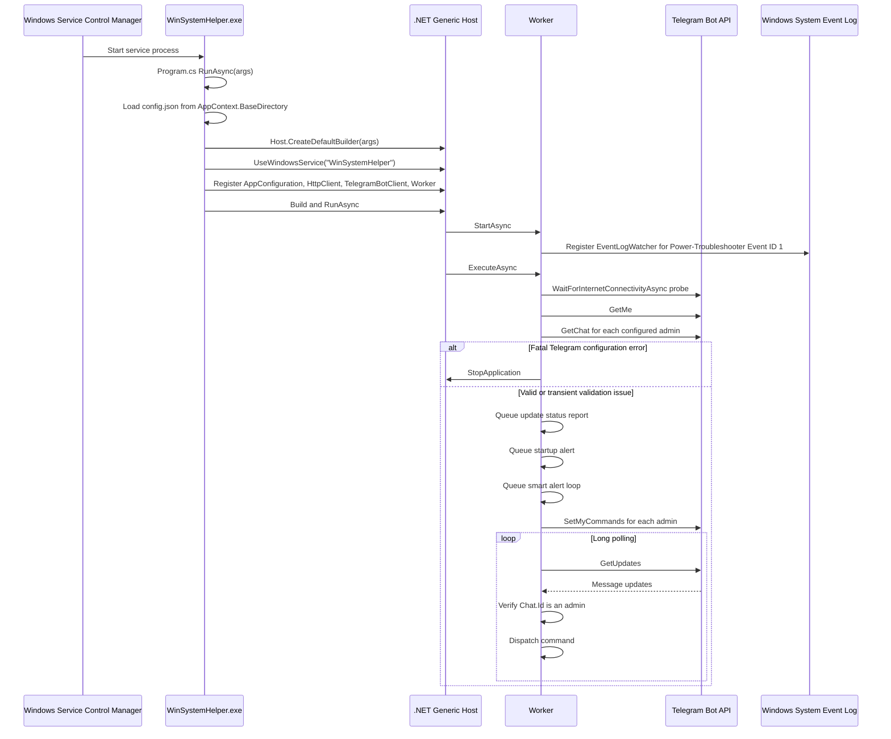

# WinSystemHelper Startup Flow

## 1. Short overview

WinSystemHelper has two startup entry points:

- `WinSystemHelper.Bootstrapper.exe` is an optional native bootstrapper. It checks whether the .NET 8 x64 Runtime is installed, downloads and installs it if missing, then launches `WinSystemHelper.exe` with the original arguments.
- `WinSystemHelper.exe` is the actual .NET 8 Worker Service application. Its top-level entry point is `Program.cs`, which chooses between microphone helper mode, silent CLI install/uninstall mode, first-run interactive setup, or Windows Service mode.

Runtime configuration is read from `config.json` in `AppContext.BaseDirectory`. The service uses dependency injection through `Host.CreateDefaultBuilder(args)`, registers `AppConfiguration`, `IHttpClientFactory`, `ITelegramBotClient`, and `Worker`, then runs the hosted worker. There is no database, HTTP middleware pipeline, routes, controllers, hubs, or ASP.NET health-check endpoint in this codebase.

## 2. Mermaid flowchart

```mermaid
flowchart TD
    A["Optional start: WinSystemHelper.Bootstrapper.exe"] --> B{"--version or /version?"}
    B -->|Yes| C["Print bootstrapper version and exit 0"]
    B -->|No| D["Resolve AppContext.BaseDirectory"]
    D --> E["Require WinSystemHelper.exe beside bootstrapper"]
    E --> F{"Is .NET 8 x64 Runtime installed?"}
    F -->|No| G{"Running as Administrator?"}
    G -->|No| H["Log and exit 1"]
    G -->|Yes| I["Download runtime from Microsoft aka.ms URL"]
    I --> J["Run runtime installer: /install /quiet /norestart"]
    J --> K{"Runtime detected after install?"}
    K -->|No| H
    K -->|Yes| L["Continue"]
    F -->|Yes| L
    L --> M{"Args require install or uninstall?"}
    M -->|Yes| N{"Running as Administrator?"}
    N -->|No| H
    N -->|Yes| O["Launch WinSystemHelper.exe with original args"]
    M -->|No| O

    O --> P["WinSystemHelper Program.cs top-level entry"]
    P --> Q{"First arg is /recordmic-helper?"}
    Q -->|Yes| R["Run NAudio WaveInEvent recorder helper and exit"]
    Q -->|No| S{"Any command-line args?"}
    S -->|Yes| T["RunSilentCliModeAsync"]
    T --> U{"/uninstall?"}
    U -->|Yes| V["Check admin, stop/delete service with sc.exe, exit"]
    U -->|No| W{"/install with token and chatid?"}
    W -->|No| X["Print CLI error and exit 1"]
    W -->|Yes| Y["Check admin, save config.json, create/start Windows Service with sc.exe"]
    S -->|No| Z{"config.json exists?"}
    Z -->|No| AA{"Environment.UserInteractive?"}
    AA -->|Yes| AB["First-run setup wizard: prompt token/admin IDs, save config, install service"]
    AA -->|No| AC["Run service mode"]
    Z -->|Yes| AC

    AC --> AD["LoadConfiguration from AppContext.BaseDirectory/config.json"]
    AD --> AE["Host.CreateDefaultBuilder(args)"]
    AE --> AF["UseWindowsService with service name WinSystemHelper"]
    AF --> AG["Register services: AppConfiguration, HttpClient, TelegramBotClient, Worker"]
    AG --> AH["Build host and RunAsync"]
    AH --> AI["Worker.StartAsync registers EventLogWatcher wake detector"]
    AI --> AJ["Worker.ExecuteAsync starts"]
    AJ --> AK["Validate Telegram config: WaitForInternetConnectivityAsync, GetMe, GetChat for admins"]
    AK -->|Fatal config error| AL["Log critical, StopApplication, exit worker"]
    AK -->|Valid or transient validation issue| AM["Queue pending update status, startup alert, smart alert loop"]
    AM --> AN["Register Telegram command menu for all admins"]
    AN --> AO["Enter Telegram long-poll loop"]
    AO --> AP["Receive updates, enforce admin allowlist, dispatch commands"]
    AP --> AO
```

## 3. Mermaid sequence diagram



## 4. Important files involved

- `WinSystemHelper.Bootstrapper/Program.cs`: optional native bootstrapper. Checks .NET 8 runtime through `dotnet --list-runtimes`, registry, and file-system probing; downloads and installs runtime if missing; launches `WinSystemHelper.exe`.
- `install.ps1`: PowerShell fallback for runtime check/install and app launch.
- `Program.cs`: application entry point. Selects helper, CLI install/uninstall, first-run setup, or service host mode.
- `AppConfiguration.cs`: runtime configuration model for bot token, admin chat IDs, alert settings, cooldowns, and confirmation settings.
- `Worker.cs`: hosted background service. Registers wake detection, validates Telegram configuration, starts startup/update/smart-alert background work, registers Telegram commands, and runs the polling loop.
- `WinSystemHelper.csproj`: main Worker Service project, target framework, package dependencies, version, and publish exclusions.
- `WinSystemHelper.Bootstrapper/WinSystemHelper.Bootstrapper.csproj`: NativeAOT bootstrapper project and version metadata.
- `build.cmd`: release packaging script for framework-dependent app plus bootstrapper into `dist/`.
- `README.md`: user-facing install, build, configuration, and OTA notes.

## 5. Notes about missing or unclear startup behavior

- Database connections: none found. I checked `Program.cs`, `Worker.cs`, `AppConfiguration.cs`, and the project file; there are no `DbContext`, connection strings, SQL clients, or database initialization paths.
- Middleware pipeline: none found. This is a Generic Host Worker Service, not an ASP.NET Core web app. I checked for `UseRouting`, `MapControllers`, `MapHub`, and middleware setup and found none.
- Routes/controllers/hubs: none found. Telegram commands are dispatched inside `Worker.HandleUpdateAsync`; there are no ASP.NET controllers, routes, or SignalR hubs.
- Health checks: there is no ASP.NET health-check endpoint. The available health behavior is the Telegram `/healthcheck` command in `Worker.cs`.
- Environment variables: `Host.CreateDefaultBuilder(args)` normally includes the default .NET host configuration sources, including environment variables. The application-specific startup logic I checked reads `config.json` from `AppContext.BaseDirectory` and does not explicitly read custom environment variable names for bot token, admin IDs, or service settings.
- Error handling:
  - Bootstrapper wraps `Main` in `try/catch`, writes `WinSystemHelper.Bootstrapper.log`, prints errors to stderr, and exits `1`.
  - `Program.cs` wraps `RunAsync` in `try/catch`; interactive failures are printed to stderr and return `1`.
  - `LoadConfiguration` throws if `config.json` is missing, invalid, or lacks `BotToken`/admin IDs.
  - `Worker.ValidateConfigurationOrStopAsync` fail-fast stops the host for missing config or fatal Telegram API errors, but allows transient Telegram/network validation errors to fall through to polling retry logic.
  - `Worker.ExecuteAsync` catches polling failures and applies exponential backoff; fatal Telegram configuration errors call `StopApplication`.
  - Background operations are queued through `QueueBackgroundWork`, which catches and logs non-cancellation exceptions.
- NativeAOT publish prerequisite: `README.md` documents that the bootstrapper publish requires Visual Studio Desktop development with C++ because NativeAOT needs the Windows platform linker. This is a build-time requirement, not a runtime startup path.
